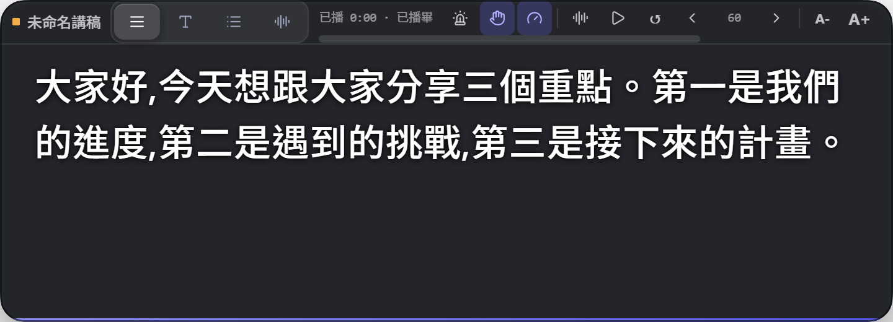

# AI 提詞機

在重要場合自信開口的桌面工具——三個模式，一個應用：

- **提詞浮層**：永遠置頂的玻璃質感浮層，邊演講邊看稿，螢幕分享時可完全隱形。四種顯示模式（連續捲動／逐句短語／重點要點／逐詞卡拉OK）、可收合成一行藥丸、貼鏡模式讓你看稿像直視鏡頭。
- **錄音轉錄**：會議雙軌轉錄（我的麥克風 + 系統音訊自動分「我／對方」），會後自動產出量化報告——發言佔比、語速趨勢、冷場次數、搶話提醒，AI 摘要與待辦一鍵生成。
- **面試練習**：AI 依職位出題、朗讀題目、你開口回答，即時反饋評分（內容／結構／表達三維）與示範回答，最後給整體總評。
- **即時教練**：會議中偵測語速過快、填充詞過多、打斷對方、冷場、單口相聲，浮層即時提醒；「該你說話了」在對方拋出問題時提示你接話。
- **Panic 救援**：被問倒時按 Alt+P，AI 即時給一句可開口的答案與要點。




## 系統需求

- Windows 10 22H2 或 Windows 11（玻璃材質效果需 Win11 22H2+，不支援時自動降級）
- 麥克風（錄音轉錄／面試練習／語音跟讀需要）；系統音訊轉錄用螢幕擷取授權

## 安裝

從 [GitHub Releases](https://github.com/Fu93/ai-teleprompter/releases) 下載 `AI 提詞機 Setup x.x.x.exe` 安裝。

> 安裝程式未做數位簽章，Windows SmartScreen 可能顯示「Windows 已保護您的電腦」——點「更多資訊」→「仍要執行」即可。這是開源專案省下憑證費用的取捨，安裝包本身可在本 repo 以 `npm run dist` 重新建置驗證。

## 使用前準備

| 功能 | 需要 | 預設 |
|---|---|---|
| 提詞浮層 | 開箱即用 | — |
| 錄音轉錄／練習／跟讀 | 語音辨識引擎 | 本地 Whisper base（~145MB，首次使用自動下載一次，之後離線） |
| 更快更準的轉錄 | 雲端 API（可選） | 設定頁填 Groq/OpenAI 相容端點 |
| 面試練習／AI 摘要／Panic 救援 | LLM 供應商 | Ollama 本地免費（需自行[安裝 Ollama](https://ollama.com)並 `ollama pull qwen2.5:7b`）；或改 OpenAI 相容 API |

第一次使用建議走完「個人化校準」（兩個小測驗量眼距與語速），字級與滾動速度會自動配成你的最適值。

## 常見問題

**全域熱鍵沒反應？** 其他應用可能佔用了同一組合，到設定頁換一顆；兩顆熱鍵選同一組合時設定頁會顯示警告。

**分享畫面時觀眾會看到浮層嗎？** 不會——工具列的「螢幕擷取隱形」預設開啟；用「分享前模擬測試」可以先看效果。

**麥克風指示燈在錄音結束後還亮著？** 正常情況不會。若遇到請回報並附上記錄檔（設定頁 → 疑難排解 → 開啟記錄資料夾）。

**資料會上傳嗎？** 轉錄（本地引擎）、講稿、會議紀錄全部只存在你的電腦。只有當你主動設定雲端 STT／OpenAI 相容 API 時，對應內容才會送往你填寫的端點。

**回報問題時該附什麼？** 設定頁 → 疑難排解 →「複製診斷報告」，會把版本、設定摘要（已遮蔽金鑰與逐字稿）、錯誤碼統計與近期事件一起產出。那份報告預設會離開這台電腦，所以遮蔽規則寫成了單元測試（`src/main/__tests__/observability.test.ts`）。

## 開發

```bash
npm install
npm run dev          # 開發（兩視窗熱重載）
npm test             # 569 單元測試（52 個檔案）
npm run lint         # ESLint（0 error；warning 上限由 eslint-baseline.json 釘住）
npm run lint:baseline # 確認 warning 沒有超過 baseline（發布閘門會跑）
npm run test:e2e     # Playwright e2e 封鎖套件（先 npm run build；與 CI 同一份清單）
npm run test:e2e:advisory # 會跑但不擋 merge 的那一支（理由写在 e2e/manifest.mjs）
npm run release      # 發布閘門：build → lint → typecheck → unit → 6 支稽核 → e2e
npm run dist         # NSIS 安裝包
```

**e2e 測試清單的唯一出處是 [e2e/manifest.mjs](e2e/manifest.mjs)**：分成「擋 merge 的封鎖套件」與「會跑但不擋的 advisory」，每一支都必須寫明理由。
新增一支 spec 沒登記會讓 `e2eManifest.test.ts` 紅燈——那是為了防止「本地閘門擋的東西比 CI 多一支」這種漂移再發生。

技術棧：Electron 44 / React 19 / TypeScript / Tailwind 4 / transformers.js（Whisper WebGPU）/ Dexie / vitest / Playwright。

## 授權

[MIT](LICENSE)
